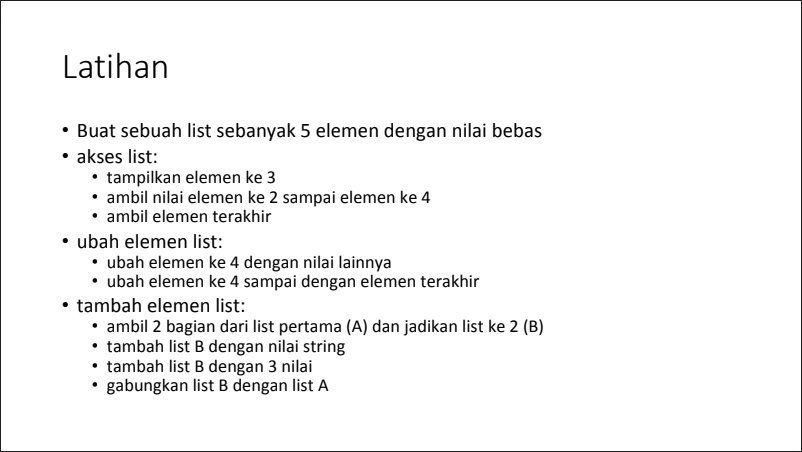
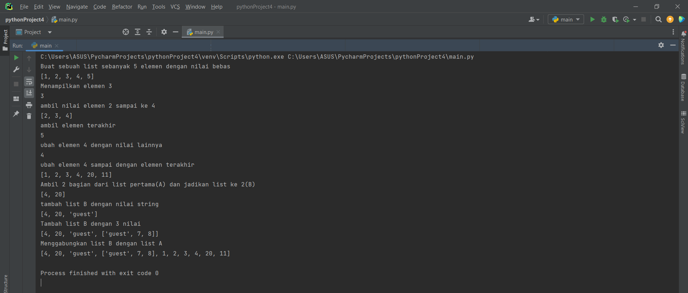
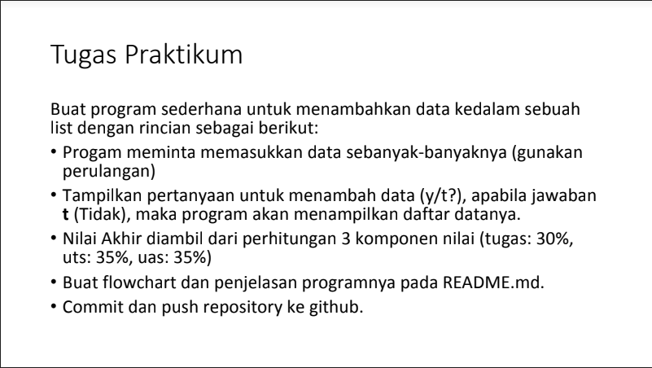
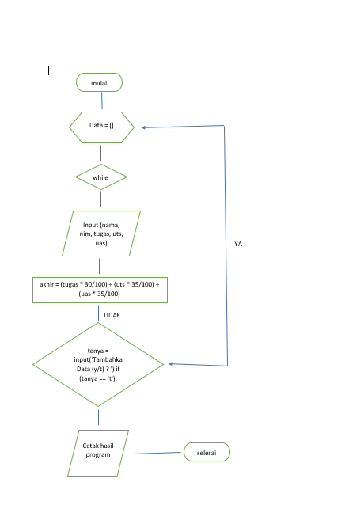
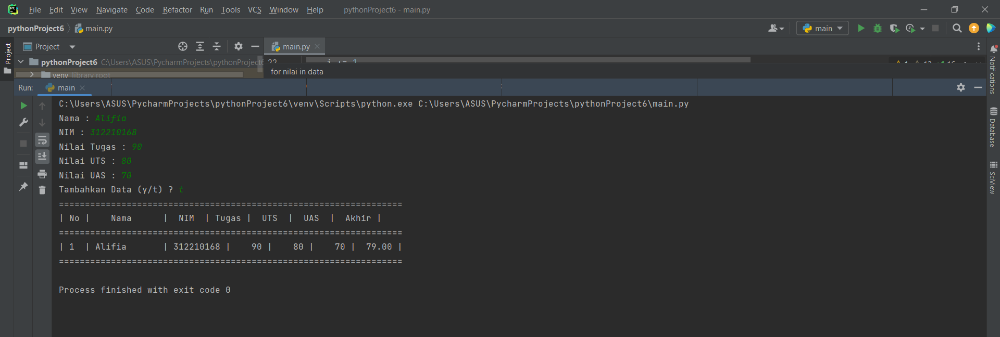

## Praktikum5

## Tugas Pertemuan ke 9

Nama: Alifia Ananda Putri

Nim: 312210168

Kelas: TI.22.A2

Pada kali ini dosen memberikan tugas sebagai berikut:

Soal Latihan yang ada pada module praktikum 4

Berikut ini syntax sekaligus langkah-langkahnya:

# membuat list
print("Buat sebuah list sebanyak 5 elemen dengan nilai bebas")
list = [1, 2, 3, 4, 5]
print(list)

# mengakses list
print("Menampilkan elemen 3")
print(list[2])

print("ambil nilai elemen 2 sampai ke 4")
print(list[1:4])

print("ambil elemen terakhir")
print(list[-1])

# mengubah elemen list
print("ubah elemen 4 dengan nilai lainnya")
list[4]=10
print(list[3])

print("ubah elemen 4 sampai dengan elemen terakhir")
list[4:5]=[20,11]
print(list)

# Tambah elemen list
print("Ambil 2 bagian dari list pertama(A) dan jadikan list ke 2(B)")
list_pertama=list[3:5]
print(list_pertama)

print("tambah list B dengan nilai string")
list_pertama.append("guest")
print(list_pertama)

print("Tambah list B dengan 3 nilai")
list_pertama.append(["guest",7,8])
print(list_pertama)

print("Menggabungkan list B dengan list A")
gabung=list_pertama+list
print(gabung)

Berikut hasil running program:

Soal Tugas praktikum module 4

## Flowchart

Berikut ini syntax sekaligus langkah-langkahnya:

data = []
stop = False
while(not stop):
    nama = input("Nama : ")
    nim = input("NIM : ")
    tugas = int(input("Nilai Tugas : "))
    uts = int(input("Nilai UTS : "))
    uas = int(input("Nilai UAS : "))
    akhir = (tugas * 30/100) + (uts * 35/100) + (uas * 35/100)
    data.append([nama,nim,tugas,uts,uas,int(akhir)])

    tanya = input('Tambahkan Data (y/t) ? ')
    if (tanya == 't'):
        stop = True

> print("==================================================================")
print("| No |    Nama      |  NIM  | Tugas |  UTS  |  UAS  |  Akhir |")
print("==================================================================")

i = 0
for nilai in data:
    i += 1
print("| {no}  | {nama:12s} | {nim:5s} | {tugas:5d} | {uts:5d} | {uas:5d} | {akhir:6.2f} |".format(no=i, nama=nilai[0], nim=nilai[1], tugas=nilai[2],uts=nilai[3],uas=nilai[4],akhir=nilai[5]))

print("==================================================================")

Berikut Hasil Running program

